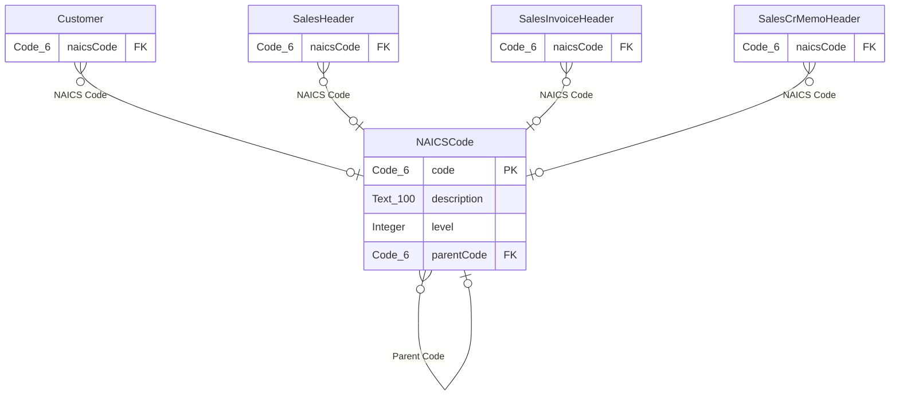

# Docs — NAICS Classification

Combined reference for developers, testers, and end users. Generated from the actual code in
`src/` as of the Step 6 review (2026-09-15) — not from memory. See `DesignDoc.md` for the full
design rationale and `ChangeLog.md` for the history of corrections made along the way.

---

## Schema

Only the fields this extension owns or adds are shown (`Customer`, `SalesHeader`,
`SalesInvoiceHeader`, `SalesCrMemoHeader` are Business Central standard tables; this extension
adds one field to each). `NAICSCode` is a new table this extension owns in full.

---

## Object reference

No API pages or queries are part of this extension (confirmed with the customer, 2026-09-15) —
this section documents the UI objects instead of an OData surface.

### Table 60470 `"ocpf NAICS Code"`

| Field | AL type | R/W | Notes |
|---|---|---|---|
| Code | Code[6] | Read/Write | Primary key. 2–6 digit NAICS code. |
| Description | Text[100] | Read/Write | Free-text description of the classification. |
| Level | Integer | Read-only | Auto-derived from `Code`'s length (2 = Sector … 6 = National Industry). |
| Parent Code | Code[6] | Read/Write | Self-referencing; blank for a 2-digit Sector code. |

Deletion is blocked while the code is referenced by any of: Customer, Sales Header, Sales Invoice
Header, Sales Cr.Memo Header.

### Pages 60471/60472 — NAICS Code List / Card

Standard list and card pages over Table 60470. Both editable. The List page is the table's
`LookupPageId`/`DrillDownPageId`, so it's what appears when picking a NAICS Code from any other
page in this extension.

### Customer (table 18, extended)

Adds `NAICS Code` (Code[6], `TableRelation` to `"ocpf NAICS Code".Code`). Shown on **Customer
Card** (after Customer Posting Group) and **Customer List** (after Name).

### Sales Header (table 36, extended)

Adds `NAICS Code` (Code[6], same `TableRelation`). Covers Quote, Order, Invoice, Credit Memo,
Blanket Order, and Return Order — all six document types share this one table
(`Document Type` differentiates them). Auto-populated from the Customer's NAICS Code whenever
`Sell-to Customer No.` is (re)validated; editable afterward, same pattern Business Central uses
for other inherited fields like Salesperson Code. Shown on all six document pages (Sales Quote,
Sales Order, Sales Invoice, Sales Credit Memo, Sales Return Order, Blanket Sales Order), after
Salesperson Code.

### Sales Invoice Header (table 112, extended) / Sales Cr.Memo Header (table 114, extended)

Adds `NAICS Code` (Code[6], read-only). Populated automatically at posting time — see below.
Shown on **Posted Sales Invoice** / **Posted Sales Credit Memo**, after Salesperson Code.

### Codeunit 60487 `"ocpf Sales Post Subscribers"`

No UI. Subscribes to `Codeunit 80 "Sales-Post"`'s `OnBeforeSalesInvHeaderInsert` and
`OnBeforeSalesCrMemoHeaderInsert` events (fired just before the posted header record is
inserted) and copies `NAICS Code` from the sales document being posted into the new posted
record.

### Permission sets

| Permission set | Grants |
|---|---|
| `OCPF - READ` | `tabledata "ocpf NAICS Code" = R`, `page "ocpf NAICS Code List"/"ocpf NAICS Code Card" = X` |
| `OCPF - READ/WRITE` | Includes `OCPF - READ`, plus `tabledata "ocpf NAICS Code" = RIMD` |

Only `"ocpf NAICS Code"` needs a grant — this is the only table the extension owns. Access to the
extended base tables (Customer, Sales Header, etc.) comes from Business Central's own base
permission sets (`D365 READ` for read-only users, `D365 BUS FULL ACCESS` for read/write users) —
assign one of those alongside the OCPF set.

### Known limitations

- No API/OData access to any of this data.
- No multi-language support for NAICS Code descriptions (English only, by design — see
  `ProblemStatement.md`).
- No report/printout layout changes — the field is visible on document *pages* only, not on
  printed Sales Quote/Invoice/etc. reports.
- Posted Sales Shipment and Posted Return Receipt do not carry the NAICS Code (out of scope by
  design — see `ProblemStatement.md`).

---

## User guide

**Maintaining NAICS Codes.** Search for "NAICS Codes" to open the list. New codes can be added
inline; each needs a `Code` (2–6 digits) and a `Description`. The `Level` field fills in
automatically based on how many digits you enter — you don't set it directly. If a code
represents a subcategory of another (for example, a 4-digit Industry Group under a 3-digit
Subsector), enter the broader code in `Parent Code`.

A NAICS Code can't be deleted while it's assigned to a customer or used on a sales document —
remove or change those assignments first.

**Assigning a NAICS Code to a customer.** On the Customer Card, the `NAICS Code` field appears
near Customer Posting Group. Use the lookup to pick from the maintained list. It also shows as a
column on the Customer List.

**On sales documents.** Once a customer has a NAICS Code, it's copied automatically onto any
Quote, Order, Invoice, Credit Memo, Return Order, or Blanket Order you create for that customer —
look for it near Salesperson Code. You can change it on the document itself if needed for that
specific transaction; that change doesn't affect the customer's own NAICS Code, and picking a
different customer on the same document will re-copy that customer's code.

**On posted documents.** Once an order is invoiced or a return posted, the NAICS Code that was on
the document at that moment is carried onto the posted record (Posted Sales Invoice / Posted
Sales Credit Memo) permanently — it won't change even if the customer's or document's code
changes afterward.

**If something is refused:** deleting a NAICS Code that's in use shows an error naming the
reason; remove the assignment(s) first. Picking a NAICS Code that doesn't exist in the list isn't
possible — the lookup only offers valid codes.

---

## Deployment

- **Requirements:** Business Central Application 28.0.0.0 or later, AL runtime 17.0. SaaS PTE
  deployment.
- **Install:** publish `outputAppPackage/OnlyCopilotFans_NAICS Classification_<version>.app`
  through Extension Management (or `AL: Publish` from VS Code against a sandbox first). No setup
  wizard — the extension is usable immediately after install (Departments placement is the only
  onboarding extra configured; no Assisted Setup Wizard or Role Center Cues).
- **Permission sets → roles:** assign `OCPF - READ` (+ `D365 READ`) to users who should only view
  NAICS Codes; assign `OCPF - READ/WRITE` (+ `D365 BUS FULL ACCESS`) to users who maintain the
  NAICS Code list or need to override the code on a document.
- **Uninstall:** standard Extension Management uninstall. Uninstalling removes the `NAICS Code`
  columns from Customer/Sales documents and the NAICS Code table itself; there is no separate
  data-export step defined for this release (the data is not currently considered business-
  critical enough to require one — revisit if that changes).
- **Schema Sync Mode:** this release is additive-only (new table, new fields on standard tables,
  no removals) — **Add** is the correct Schema Sync Mode, not Force Sync.
